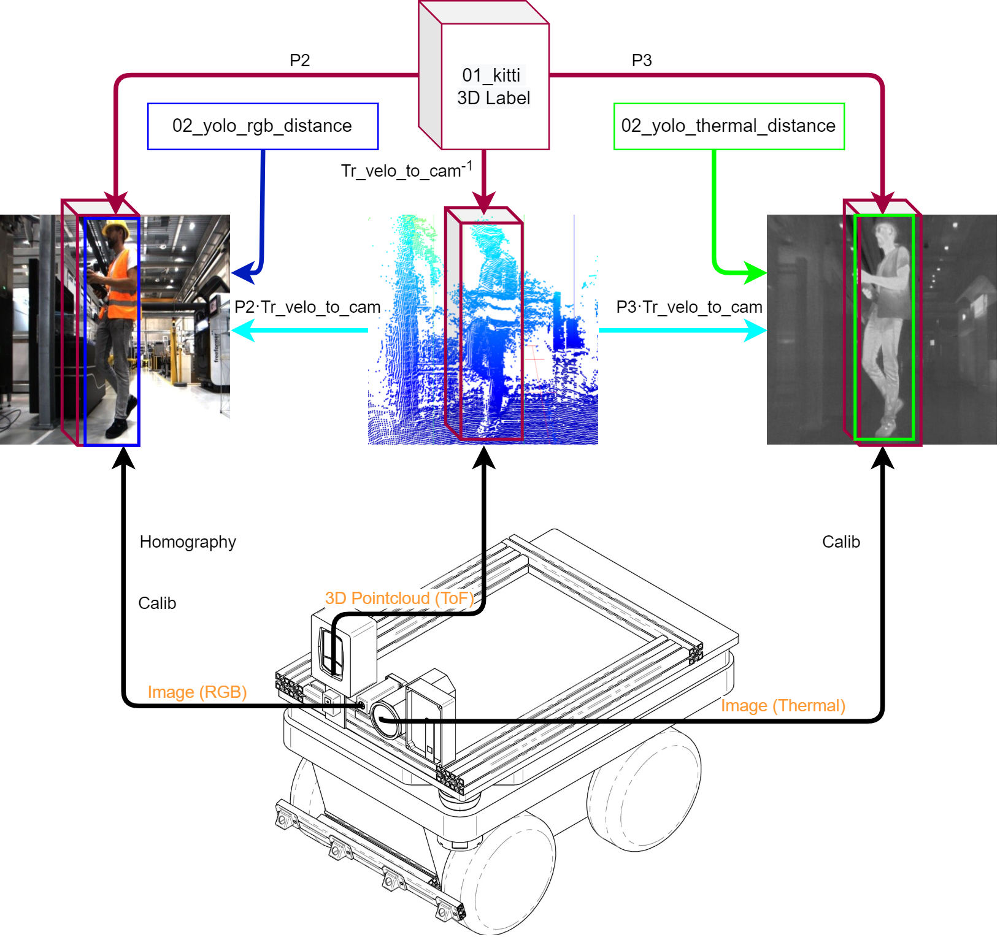
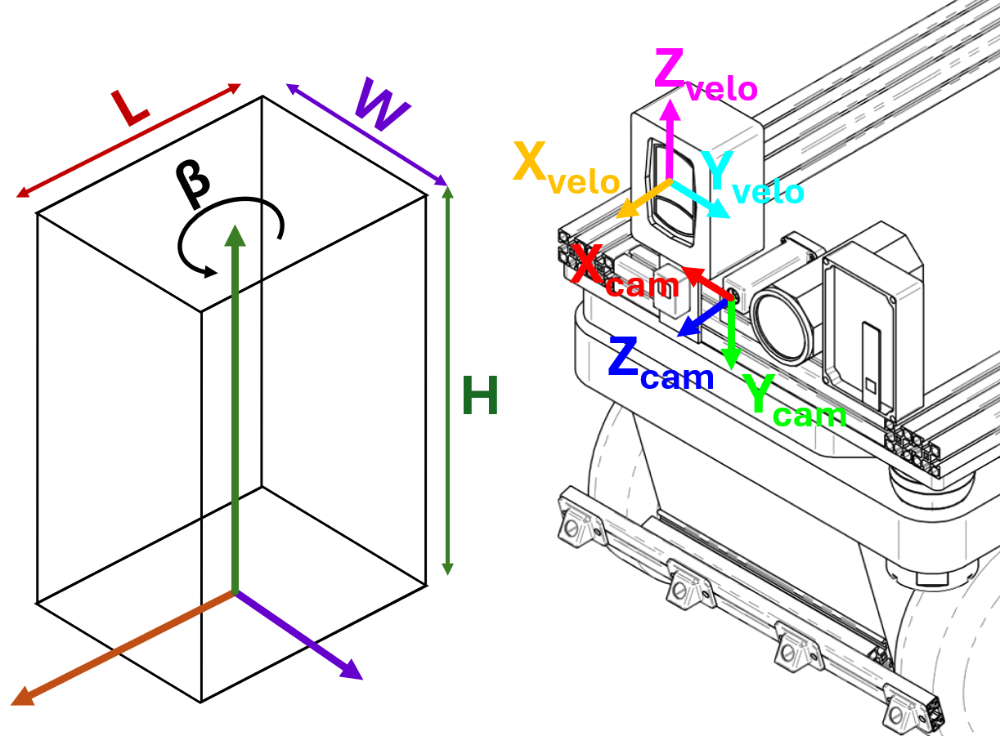
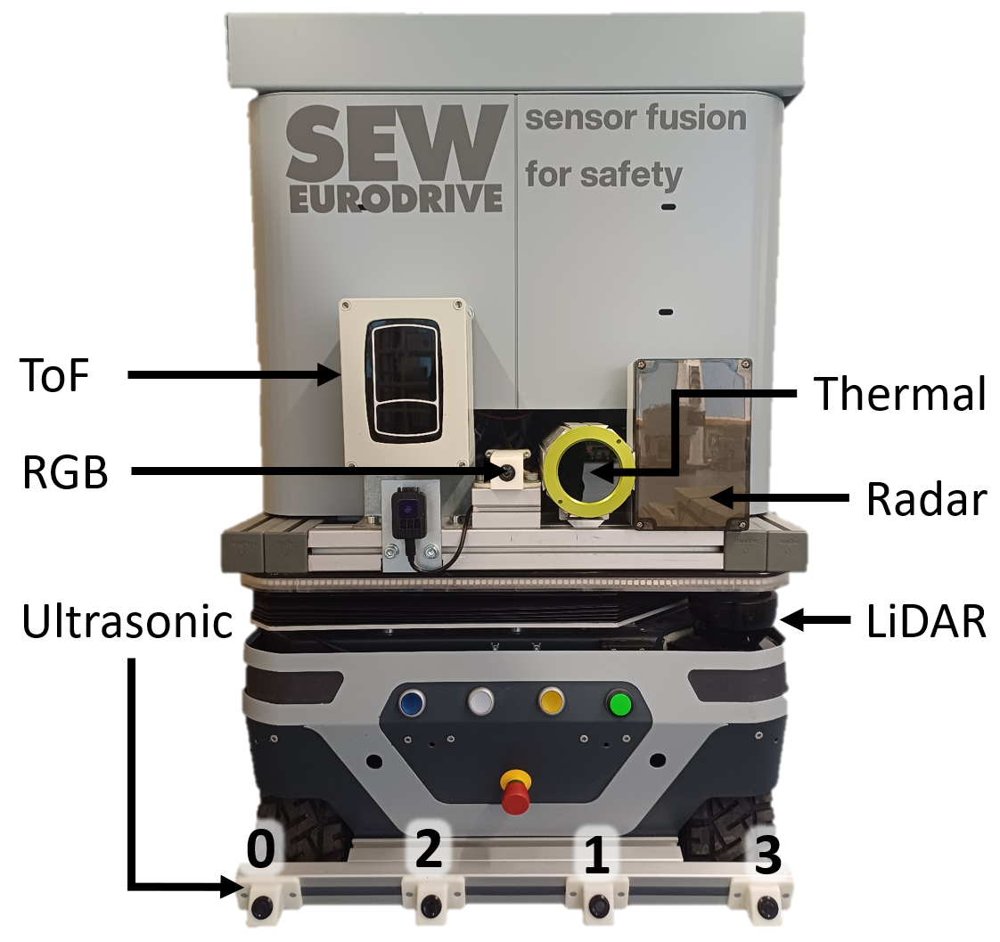

# SEW Multimodal AMR Dataset 2026 Documentation

This repository contains the documentation of our multimodal autonomous mobile robot (AMR) dataset. The documentation includes:

- [Intrinsic and extrinsic calibration files, sensor descriptions, and data formats](./sensors_and_calibration)
- [The ROS 1 URDF viewer for the AMR and its sensors](./utils/dataset_rosbag_viewer/ros1/urdf_viewer/README.md)
- [The safety and productivity challenge](./benchmark/index.html)
- [Images of our documentation and a pdf version of our technical drawing](./images)

## TL;DR

The datasets consists of synchronized and labeled key frames
from: an RGB, thermal and TOF camera, 2x 2D laser
scanner, a radar sensor, and an ultrasonic array. For each key
frame, the dataset provides:

- Raw and calibrated RGB, thermal, NIR and depth images
- ToF and Radar point clouds
- Laser scanner, ultrasonic and radar raw data
- 3D KITTI format and 2D YOLO (also with distance) format labels
- Metadata for domain, weather and lighting conditions

Preceding each key frame, every sensor has up to 3 previous unlabeled frames. All labels, metadata, calibration files, sensor data, and preceding frames have the same 6 digit number as the corresponding key frame. 
The dataset is split in 10k train frames, 2.7k val frames and 3.2k test frames. To enter our benchmark, mail us  [SEW-Dataset@sew-eurodrive.de](mailto:SEW-Dataset@sew-eurodrive.de) your predictions of one or multiple modalities of the test set. We will publish the results in the [leaderboard](https://leon-schoenfeld.github.io/Multimodal_AMR_dataset/).

<p align="center">
  
</p>

## Dataset Viewer

The included viewer provides a quick way to explore synchronized RGB, thermal, ToF, and label data. The animation above was created with images from the [SEW Dataset Viewer](./utils/SEW_Dataset_Viewer/SEW_Dataset_viewer.py).

The viewer is **KITTI-compatible**. You can verify this by downloading the original [KITTI Object Dataset](https://www.cvlibs.net/datasets/kitti/eval_object.php), setting its root directory as `base_dir` in [`config_kitti.yaml`](./utils/SEW_Dataset_Viewer/config_kitti.yaml), and running the viewer with that configuration.

### Quick Start

From the repository root:

```bash
python3 -m venv .venv
source .venv/bin/activate
python -m pip install -r requirements.txt
cd utils/SEW_Dataset_Viewer
python SEW_Dataset_viewer.py
```

Before launching, adapt `base_dir` in [`config_sew.yaml`](./utils/SEW_Dataset_Viewer/config_sew.yaml) to the location of your downloaded SEW dataset. To inspect KITTI instead, use:

```bash
python SEW_Dataset_viewer.py --config config_kitti.yaml
```

Both configurations use KITTI-style calibration transformations such as `Tr_velo_to_cam` to project the point cloud into the camera views. The sensor coordinate systems and transformation layout are illustrated in following figure.

<p align="center">
  
</p>

# Table of Contents

- [TL;DR](#tldr)
- [Dataset Viewer](#dataset-viewer)
- [Motivation](#motivation)
- [Robot Platform EFEU](#robot-platform-efeu)
- [Sensor Position and Rosbags](#sensor-position-and-rosbags)
- [Sensors and Calibration](#sensors-and-calibration)
  - [Ultrasonic Array](./sensors_and_calibration/ultrasonic/ultrasonic.md)
  - [2D Laser Scanner](./sensors_and_calibration/laserscanner/laserscanner.md)
  - [ToF Camera](./sensors_and_calibration/tof/tof.md)
  - [RGB Camera](./sensors_and_calibration/rgb/RGB.md)
  - [Thermal Camera](./sensors_and_calibration/thermal/thermal.md)
  - [Radar sensor](./sensors_and_calibration/radar/radar.md)
- [Metadata](#meta-data)
- [Recording and Synchronisation](#recording-and-synchronisation)
- [Labels](#labels)
- [Evaluation and Challenge](#evaluation-and-challenge)
- [Leaderboard](./benchmark/index.html)
- [Discussion](#discussion)
- [Download](#download)
- [Reference and Citation](#reference-and-citation)
- [License](#license)

The contributions of this dataset are as follows:

- First dataset that includes RGB images, thermal images, radar data, ultrasonic data, ToF 3D pointclouds, NIR images, 2D laser scanner range measurements, and metadata.
- 15,921 synchronized key frames across all modalities: approximately 10,000 training, 2,700 validation, and 3,200 test frames. The training and validation frames are labeled in 3D and 2D; test labels are withheld for evaluation. The timestamps of the modalities in each key frame differ by less than 40 ms.
- Challenging and diverse scenes in industrial indoor environments and in urban outdoor environments, including many edge cases and severe weather and lighting conditions.
- We enable statistical evaluation of safety and productivity of AMRs in different modalities and domains.

 <br> Preview of the different modalities in the different domains, weather, and lighting conditions.

# Motivation

Autonomous Mobile Robots (AMRs) that pose a risk of injuring people must be equipped with functional safety systems. Functional safety aims to eliminate unacceptable risks of physical harm.
In industrial indoor environments, AMRs are typically equipped with safety-certified sensitive bumpers, ultrasonic sensors, or more commonly, two 2D LiDAR laser scanners.
However, these sensors share a common limitation: they cannot classify objects. As a result, 2D laser scanners are frequently triggered by environmental factors such as rain, dust, snowflakes, branches, and leaves in outdoor applications.
These false positives lead to unnecessary stops and reduced productivity of the AMR. Moreover, laser scanners cannot distinguish between a person lying on the ground and traversable objects like curbs.
To address these challenges, it is essential to implement object classification and localisation methods that perform reliably under all weather and lighting conditions in diverse environments.

Regardless of the sensing modality, each sensor or detector combination has limitations. For example:

- RGB cameras fail in low-light conditions or when exposed to direct sunlight.
- Thermal cameras struggle in hot environments where the temperature gradient between a person and the background is minimal.
- Time-of-Flight (ToF) cameras can be blinded by sunlight and distorted by snowflakes.
- Radar sensors have difficulty localising multiple objects simultaneously and may miss low-reflectance targets like humans in the presence of nearby metal objects.
- Ultrasonic sensors offer low information density and short range, leading to undetected objects.

To overcome these challenges, we propose a multi-modal sensor fusion approach. By combining different sensing modalities,
we aim to eliminate common-cause failures and enhance the robustness of object detection and classification in diverse environments.

Our greater goal is to achieve safe AMRs in outdoor applications, more flexible safety in industrial human-robot collaborations and reduced overall cost.
We therefore want to compare object classification and localisation methods in the different modalities.
We want to evaluate the safety and productivity of each modality, depending on the domain (industrial indoor or European urban outdoor), weather and lighting conditions.

# Robot Platform EFEU

The efeuCampus Bruchsal GmbH, established in 2018 as a wholly-owned subsidiary of the city of Bruchsal, aims to revolutionize urban logistics through innovative, eco-friendly solutions.
The abbreviation **EFEU** stands for **E**co-**F**riendly **E**xperimental **U**rban logistics.
The project focuses on reducing the environmental impact of urban logistics by using AMRs for the delivery of parcels and for the collection and disposal of waste.
Each AMR can handle two containers that can be placed in transfer docks or opened by the user with their credentials over a web application.
Since the perception of the AMR is not safe yet, they have to be accompanied by a person with a wireless emergency stop.
One of the five AMRs carries a sensor bracket in place of one of the containers and is therefore limited to deliveries with one container.
The sensor bracket is described in the following.

# Sensor Position and Rosbags

The sensor bracket consists of a ToF camera, a RGB camera, a thermal camera, a radar array, a temperature sensor and a control cabinet. The two 2D laser scanners are integrated in the body of the AMR, as well as the ultrasonic sensor array.
The control cabinet contains an _Intel UP Xtreme_ PC, a switch, and power supplies for 5V, 12V, 24V and 230V AC.

|  <br> ToF coordinate system for the `.bin` files. |  <br> AMR and sensor coordinate-system representation. |
| -------------------------------------------------------------------------------------------------------------------------------------------------- | ----------------------------------------------------------------------------------------------------------------------------------------------------------------------------------------------------- |
|  <br> Frontal view on the sensor bracket mounted on the AMR. |  <br> PDF version: [EFEU AMR CAD](./images/EFEU_AMR_CAD_simplified.pdf). |

Besides the technical drawing, all sensor positions and the model of the AMR are saved in [the ROS 1 URDF viewer](./utils/dataset_rosbag_viewer/ros1/urdf_viewer/).

## Rosbags

To view the AMR with the sensors, their coordinate systems, and the data, the ROS 1 rosbags can be played with the `urdf_viewer` package:

- [ROS 1 URDF viewer](./utils/dataset_rosbag_viewer/ros1/urdf_viewer/README.md)

 <br> Playing the Rosbag in RVIz and visualizing the two laser scanners, the ToF 3D point cloud, the rgb image, thermal image, the AMR, and all coordinate systems.

# Sensors and Calibration

## Ultrasonic Array

Four automotive ultrasonic sensors are mounted equally spaced at the front of the AMR and are tilted upwards.
All information about the four ultrasonic sensors can be found in the [ultrasonic sensor documentation](./sensors_and_calibration/ultrasonic/ultrasonic.md).

## 2D Laser Scanner

Two Sick Microscan 3 laser scanners are mounted on two diagonal opposed corners to have a 360° view of the scene without any blind spots.
All information about the two laser scanners can be found in the [2D laser scanner documentation](./sensors_and_calibration/laserscanner/laserscanner.md).

## ToF Camera

The ESPROS TOFcam660 is a 3D ToF camera the offers a dense 3D point cloud, depth images, and active NIR illuminated 2D images of the scenes.
All information about the ToF camera can be found in the [ToF camera documentation](./sensors_and_calibration/tof/tof.md).

## RGB Camera

The industrial RGB camera from Baumer is equipped with a global shutter and and a 2/3" CMOS sensor and is capable of recording scenes in very low light conditions.
All information about the RGB camera can be found in the [RGB camera documentation](./sensors_and_calibration/rgb/RGB.md).

## Thermal Camera

The Flir Boson 640 is a high resolution thermal camera without cooling. With high dynamic range, even small temperature gradients are visible.
All information about the thermal camera can be found in the [thermal camera documentation](./sensors_and_calibration/thermal/thermal.md).

## Radar Sensor

The MIMO radar sensor AWR1843AOP from Texas Instruments has 3 TX antennas and 4 RX antennas. It is therefore capable of recording 4D scenes with Azimuth, Elevation, Range and Doppler.
All information about the radar sensor can be found in the [radar sensor documentation](./sensors_and_calibration/radar/radar.md).

# Metadata

The metadata is saved as a `.txt` for each frame with the following information:

- Season: Spring, Summer, Autumn, Winter
- Weather: Sunny, Cloudy, Overcast, Rain, Snow, Indoor
- Daytime: Day, Dawn, Night
- Name of Rosbag with date and time

Additionally, the air temperature is saved in °C in the /08_ultrasonic/pub_1/ `.json` `"temperature": ` message of the ultrasonic sensor to compensate for the temperature dependent speed of sound.

# Recording and Synchronisation

All scenes were recorded with ROS 1 rosbags. The bags are extracted and a key-frame data cluster with all modalities is saved if their timestamps do not differ by more than 40 ms. Up to three preceding, unlabeled frames are provided for each modality when available.
The ToF has an offset of the timestamp, due to its long internal processing.
The synchronising was validated by rotating heated resistors, that were visible in all modalities, except ultrasonic.
The ultrasonic sensors were synchronised by approaching a wall with the reference distance from the ToF camera and laser scanners.

 <br>
Time synchronization of the ros messages of the different modalities. The dashed blue frame shows a time slot of 40ms where all sensors have at least published one message.
If a sensors has several messages in the time frame, the message closest to the center of the time frame is chosen.

# Data Distribution

## Scenes

| Start Frame | End Frame | Description                                                                                              |
| ----------- | --------- | -------------------------------------------------------------------------------------------------------- |
| 000000      | 002282    | Simple scenes with only one object at a time to train the ultrasonic and radar object detectors, outdoor |
| 002282      | 005339    | Challenging and diverse scenes including edge cases, outdoor                                             |
| 005890      | 013252    | Industrial manufacturing and research facility, indoor                                                   |
| 016437      | 059094    | Challenging and diverse scenes including rain, snow and night, indoor and outdoor                        |

To make the dataset challenging and divers and leverage detectors to better generalize, the dataset includes edge cases like:

- Several bicycle accidents, also by night and rain.
- Persons running, jumping, hiding, sitting, lying, handstand or riding the slide car.
- Snow environment and snowballs, thrown at all sensors.
- Persons lying in high grass (especially for ultrasonic and radar).
- Doll lying on cobblestone (especially for ultrasonic and radar).
- Complete darkness with blinding (especially for rgb).
- Hot indoor environments (especially for thermal).

## Object Distribution and Conditions

|             |                       |               |
| ---------------------------------------------------------------- | ------------------------------------------------------------------------- | ------------------------------------------------------------------ |
|        |    |  |
|      |                |                  |

# Labels

The dataset contains the following labels:

- 0 person
- 1 bicycle
- 2 slidecar
- 3 doll
- 4 vegetation (Only in 3D)
- 5 curb (Only in 3D)

## 3D

The 3D point clouds are manually labeled in CVAT [4] using the KITTI format. The rotation of the bounding boxes is adjusted to create the smallest possible 3D box that fully encloses the object.
However, the vertical rotation does not necessarily indicate the direction of walking or driving.  
The labels use the standard KITTI coordinate convention [2]. They are aligned
with the 3D point clouds of the ToF camera and can be projected into the RGB and
thermal images, radar frames, ultrasonic data, and laser scans.

## 2D RGB

The 3D labels, that were manually labeled in CVAT, are projected with their wire frame into the RGB images. A 2D bounding box that fully encloses the projected wire frame is used as a label proposition.
The proposed labels are in the YOLO [3] format and are then manually aligned with the calibrated RGB images.

## 2D RGB labels with distance

The 2D labels with distance are in the YOLO [3] format, but with the distance as another parameter in the last position of the label.
The distance is the closest point's forward `z` coordinate in meters, measured by the ToF camera and 2D laser scanners; it is not the Euclidean distance.
The labels are otherwise identical to the 2D YOLO labels and aligned with the calibrated rgb images.

## 2D thermal and 2D thermal with distance

The calibrated RGB and thermal images were manually aligned to match at a distance of 1.5 m.
Due to the side-by-side installation of the two cameras, horizontal misalignment increases at distances shorter or greater than 1.5 m and is physically unavoidable.
To generate the thermal labels, the center of the RGB labels is shifted depending on the object's distance to align with the thermal objects.
This shift is applied automatically and the labels are then manually adjusted for residual parallax.

The thermal labels with distance use the same distance values as the RGB labels with distance.

When an object is oriented such that the z-distance (depth) varies significantly between the points defining the left and right edges of its bounding box,
the object is shifted based on the point closest to the camera.
Consequently, the farther edge becomes misaligned, as its greater distance is not accounted for in the shift computation.
This depth-induced misalignment is particularly pronounced for elongated objects, such as bicycles, when they are positioned at short distances from the camera.

# Dataset Structure

The extracted dataset is organized by split. Each split contains synchronized key
frames and, where available, up to three preceding unlabeled frames:

```text
SEW_Dataset/
├── Ros1/
├── misc/
└── train/                         # validation/ and test/ use the same layout
    ├── 00_meta_data/
    ├── 01_kitti/
    ├── 02_yolo_rgb/
    ├── 02_yolo_rgb_distance/
    ├── 02_yolo_thermal/
    ├── 02_yolo_thermal_distance/
    ├── 03_calib/
    ├── 04_timestamps/
    ├── 30_laserscanner/
    │   ├── left_front/
    │   └── right_back/
    ├── 40_radar/
    │   ├── images/
    │   │   ├── azimuth_abs/
    │   │   ├── azimuth_phase/
    │   │   ├── doppler_abs/
    │   │   ├── doppler_phase/
    │   │   ├── elevation_abs/
    │   │   └── elevation_phase/
    │   ├── matfile/
    │   └── pointcloud/
    │       ├── csv/
    │       └── pcd/
    ├── 50_rgb/
    │   ├── calibrated/
    │   └── images/
    ├── 60_thermal/
    │   ├── calibrated/
    │   └── images/
    ├── 70_tof/
    │   ├── amplitude/
    │   ├── depth/
    │   └── pointcloud/
    │       ├── bin/
    │       └── pcd/
    └── 80_ultrasonic/
        ├── pub_1/
        └── pub_4/
```
    The preceding-frame folders use the same modality layout with prefixes
    `31`-`33`, `41`-`43`, `51`-`53`, `61`-`63`, `71`-`73`, and `81`-`83`, where
    available. Only key-frame folders contain labels and calibration data.

The radar `images/` directory contains azimuth, elevation, and Doppler images
in absolute-value and phase variants. The radar `matfile/` directory contains raw 4D ADC data recorded by an FPGA-based
board before FFT processing.

The `04_timestamps/` directory contains per-frame timestamp metadata linking
each dataset frame to its corresponding sensor measurements and preceding frames.

# Evaluation and Challenge

The [SEW Multimodal AMR Safety Challenge](./benchmark/index.html) evaluates object-detection methods by their safety and productivity on the test set. It reports safety, productivity, and combined performance at 2.5 m and 10 m. The benchmark page describes the submission process and provides the current leaderboard.

A detailed description of the evaluation methodology is provided in the corresponding dataset paper.

The benchmark treats persons, bicycles, dolls, and slidecars as non-traversable, while curbs and vegetation are traversable. Its combined performance score emphasizes dangerous failures while retaining productivity, so predictions are evaluated by their effect on the AMR's drivable area rather than by overlap alone.

# Discussion

## Representative

For a representative dataset to validate the AMR for a productive real work environment, it would be best if the robot had gathered the dataset on normal routes with normal pedestrians.
However, our campus is not crowded and most pedestrians avoid the AMR, not interfering with its path. Therefore, many hours of normal driving operation result in almost no protective field violation for training and validation.
Since the AMR needs permission for public environments and persons that are recorded close up have to sign a privacy policy, it was not possible to choose crowded city centres or similar environments to record the dataset.
We therefore deliberately expose the AMR to as many edge cases as possible

The doll should represent a child, but the body proportions do not match those of a child. Furthermore, the doll has no heat signature. It has proven infeasible to heat the doll evenly for long scenes.
Therefore, no individuals under the age of 18 are included, and the doll is labeled as a doll rather than a person.

## Label alignment

The outlines of the 3D bounding boxes do not project perfectly into the 2D image space of the RGB and thermal cameras, so we manually aligned all the 2D labels for the RGB and thermal camera.
Since a beam splitter for thermal and RGB cameras is expensive, requires more space, and needs manual adjustment, there is a low chance it will be used in commercially available outdoor AMRs.
We therefore accept poorer performance of RGB and thermal fusion in order to keep the setup simple.
While the distance-dependent misalignment of the RGB labels in the thermal images decreases the detection performance in a deep fusion branch, it enables the network to better estimate the distance to objects.

## Labelled curbs and vegetation

Radar and ultrasonic object detectors distinguish better between curbs and lying persons than between lying persons and background (no label).
Therefore, we added them to the 3D labels.
Since missing a curb does not pose a safety risk, they are not considered for our evaluation and leaderboard.

# Download

The paper describes three download packages:

| Package | Contents | Download size |
| ------- | -------- | ------------- |
| Val set | Validation set with one ROS 1 bag for a small preview | 10 GB |
| Main set | Train, validation, and test sets with multiple ROS 1 bags and preceding frames for all test key frames | 85 GB |
| Main set T3 | Preceding train and validation frames without key frames or labels | 130 GB |

For download access or additional information, contact SEW-Dataset@sew-eurodrive.de.

If you need further information or data, have questions, suggestions, or improvements, please contact us at
SEW-Dataset@sew-eurodrive.de. We have ~45.000 more synchronized unlabelled data points of each modality, the undistorted images as well as the original rosbags.

# Reference and Citation

[1] BRAND, Lukas; WUNDERLE, Yannick; HOHMANN, Sören. Ultrasonic Object Detection and Classification for AMR Safety. In: 2024 IEEE 29th International Conference on Emerging Technologies and Factory Automation (ETFA). IEEE, 2024. S. 01-06  
[2] GEIGER, Andreas, et al. Vision meets robotics: The kitti dataset. The international journal of robotics research, 2013, 32. Jg., Nr. 11, S. 1231-1237.  
[3] REDMON, Joseph, et al. You only look once: Unified, real-time object detection. In: Proceedings of the IEEE conference on computer vision and pattern recognition. 2016. S. 779-788.  
[4] MANOVICH, Nikita, et al. Computer Vision Annotation Tool (CVAT), 2020, URL: https://github.com/cvat-ai/cvat

Please cite:

@misc{sew_dataset_2025,  
  author       = {{SEW-Eurodrive GmbH \& Co. KG}},  
  title        = {{SEW-Dataset}},  
  year         = {2025},  
  url          = {https://share.sew-eurodrive.de/sew-dataset/},  
  note         = {Maintained by Yannick Wunderle. Accessed: 2025-05-28}  
}

# License

The contents of this documentation is licensed under the [CC-BY-4.0 license](./LICENSE.CC-BY-4.0).  
The code in [utils/demo_scripts/\*](./utils/demo_scripts/) is licensed under the [MIT license](./LICENSE.MIT).
The dataset itself is licensed under the CC-BY-SA 4.0 license.
